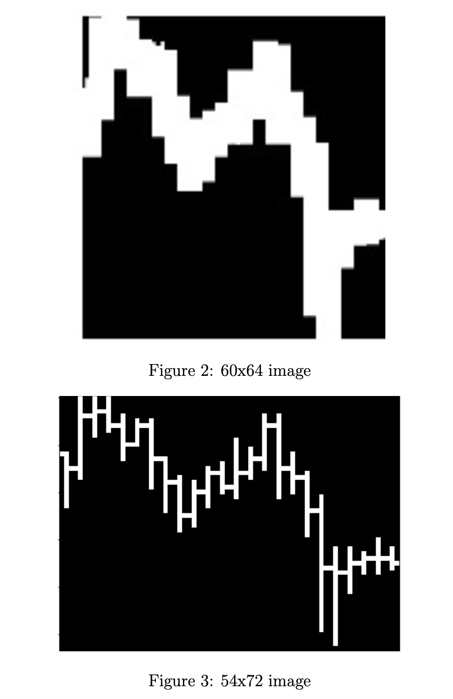
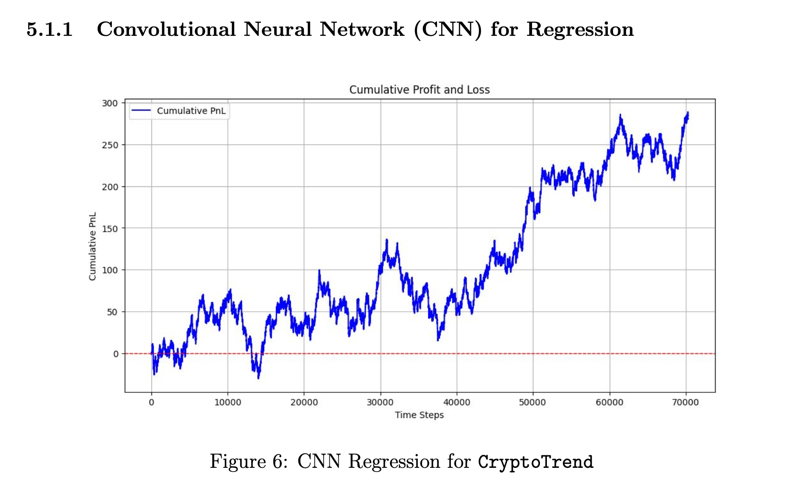

Note from Newt: Special thanks to [Darren](https://www.linkedin.com/in/shawn-darren-chua/) for your great contribution to this project!

## 1 Background

### 1.1 Motivation

A substantial body of literature explores the application of computer science in financial prediction based on historical trends. Key strategies in this field include price momentum [1], mean reversion [2], sentiment analysis [3], and time series analysis [4].

While these traditional methods can be effective in many contexts, they often overlook the psychological and behavioral factors that drive market movements. Additionally, most existing research primarily concentrates on time-series numerical data. In this project, we propose a novel approach: representing past price data as images and using image analysis to extract meaningful insights.

### 1.2 Methodology

We use historical price data to generate images that represent price movements. Our
model inputs are 54x72 grayscale images to capture price trends from Jan 1st, 2021 until October 31th, 2024. We then use Convolutional Neural Networks (CNN) to identify
notable trends and features for classification (buy/sell). Afterwards, we compare the
performance of our CNN model with a baseline model. We also independently evaluate
our model based on its profit and loss (PnL) and Sharpe Ratio.

## 2 Dataset and Preprocessing

### 2.1 Background

There is no publicly available image data for cryptocurrencies, so we generate our
own image data. We collect numerical data from Binance and streamline a process to
generate images from this data.

### 2.2 Scrapping Process

We use the Binance API to scrape hourly candlestick information on cryptocurrency
spot from https://data.binance.vision/. We opted for Binance because it has data for a wide range of coins with lots of freedom to choose different specifications. Binance has a separate zip file per day, which we are able to access via a checksum. We automate a process to compile all the zip files and merge them into organized Pandas data frames.

### 2.3 Numerical Dataset Description

Our dataset consists of 10 cryptocurrencies: Bitcoin (BTC), Binance coin (BNB),
Dogecoin (DOGE), Polkadot (DOT), Etherum (ETH), Litecoin (LTC), Solana (SOL),
Tron (TRX), Uniswap (UNI), and Stellar (XLM).

For each coin, we have hourly data from Jan 1st, 2021 to October 31th, 2024. This
includes features including Open, High, Low, Close, and Volume. Together, these
comprise ourCryptoTrendimage dataset.

We also run feature engineering, notably by adding a column for our main independent
variable: LogReturns. We get this by dividing the closing price by the opening price.
(np.log(data["Close"]/data["Close"].shift(1)).

Test again

We use data from January 1st, 2021 to March 31st, 2024 for training and validation
and data from April 1st, 2024 to October 31th, 2024 for testing. We construct images
which contain Open, High, Low, and Close data over the past 24 hours, which we use
to predict future 1-hour log returns.

### 2.4 Data Processing and Image Engineering

2.4.1 Processing

First, we clean the data we crawl from Binance. Lots of cryptocurrencies have missing
data, so we first check over 30 popular coins and pick the coins with the most complete data. We then filter out a few timestamps that are absent in most coins, leaving only a few missing data points in singular coins, usually over time spans of less than a day. Given the short time frame, we decide to impute the gaps with the last seen numerical values of the appropriate coin.

As we mentioned above, we also add another column for log returns into our dataset. This is motivated by how returns are pseudo log-normally distributed. Log returns possess several notably features, including, but not limited to time-additivity, suitability for statistical analysis, and consistency across different investment horizons. This is opposed to standard returns, which are frequently misleading, particularly when dealing with compounding effects over time.

2.4.2 Image Engineering and CryptoTrend Dataset

Given that we use a CNN for price prediction, we put extra attention into image
engineering. Our main plot utilizes candlestick bars. High and low prices are illustrated by the top and bottom of the vertical bar, respectively. At the same time, we indicate opening and closing prices with small horizontal lines to the left and right, respectively.

In the proposal, we mentioned that we would use 60x64 images. We decided to use a
width of 72 pixels, which corresponds to 3 pixels per hour. Meanwhile, we settled at a height of 54 after lots of trial-and-error, to see which images would yield the clearest opening and closing prices.

The vertical dimension of our image carries the two most important signals. First, it
conveys the price trend of the coins, i.e. whether the coins are on a short-term uptrend or downtrend. Second, it shows the volatility of the coin over that hour. There is a paper [5] that determines that the high-low range over different intervals is helpful for volatility inference.

We decide not to incorporate volume information into the image since we believe that
including a volume chart may confuse the model’s convolutional layers. Given that
we try to predict future returns with only the past day of data, we also refrain from
including technical indicators such as long-term moving averages.

We then convert images to grayscale, with a black background and white vertical bars.
We make the images as simple as possible to minimize the amount of data we feed
into the model for computation purposes. Additionally, we believe that having color
is redundant since the model can intuit all the relevant information and price trends
from the data.

After generating the images for each coin, we export all of them to a .datfile. We
then use np.memmapto convert those images into numpy arrays.

Figure 4 illustrates 10 images randomly chosen from one of our numpy arrays. This
dataset has 284,000 images, each of which has size 54x72.

We denote this set of images as CryptoTrend.

2.4.3 2-layer data

We also seek to utilize Bitcoin’s correlation with other cryptocurrencies. Notably,
Bitcoin is a leading indicator for some other coins. This way, we can teach our model
to determine when a certain coin incorrectly diverges from Bitcoin’s trend.

To learn this, we concatenate (54, 72) images from our 9 coins with (54, 72) images
from Bitcoin, resulting in an array of (2, 54, 72) images. For each coin, we have 28400 training and validation data points, as well as 5111 testing data points.

We use this dataset for classification. Log returns are now unnecessary as an independent variable, so we discard its corresponding column.

## 3 Machine Learning Tasks

We use theCryptoTrendimage dataset generated above for both regression and classi-
fication. Our main motivation for developing a regression model is the presence of skew in the log returns of most asset classes. Skew makes it such that naively prediction the direction of the median all the time will result in an accuracy of greater than 50%, without any opportunities for profit. Our regression output is log returns, normalized by the scale of the image, which is proportional to the highest high minus the lowest low of the corresponding coin over the past 24 hours.

Meanwhile, our main motivation for developing a classification model is the inherent
noise present in financial data. Predicting the returns of highly volatile products such as cryptocurrencies, even just a minute in advance, is extremely difficult. In response to the issue of skew, we note that skew shouldn’t play that big a role short-term. Our classification output is the directional change of the coin over the next hour. We want to predict 1 if the log returns are positive and 0 otherwise.

To summarize, we explore 2 main machine learning tasks:

- Regression: Predict normalized log returns
- Classification: Prediction the direction of returns

## 4 Machine Learning Methods

### 4.1 Novelty of our Methodology

Price trends contain subtle signals that are hard to discover with just standard methods, such as price momentum and reversal. At the same time, the average retail trader generally does not make decisions based on numerical data, but instead on image data.

As mentioned above, there is a huge body of literature focused on forecasting price
movements with machine learning. However, most focus on numerical time series data.
Our proposed solution seeks to discover a novel way of addressing the limitations of
previous works.

### 4.2 Evaluation Metrics

4.2.1 Sharpe Ratio

We use the Sharpe Ratio as one of our main metrics in measuring the performance of
our models. The Sharpe Ratio calculates a strategy’s risk-adjusted investment perfor-
mance.

The formula for the Sharpe Ratio is as follows:

The Sharpe Ratio is one of the most used metrics in gauging the efficacy of financial
strategies as it represents how much money you can expect to earn given a fixed amount of risk. It is designed such that scaling up the volume traded will keep the Sharpe Ratio constant.

We will apply 2 numerical values for Sharpe Ratio, which is Basic Strategy Sharpe
Ratio, and Dynamic Strategy Sharpe Ratio.

- Basic Strategy Sharpe Ratio: This ratio is calculated based on a fundamental trading strategy, where we either buy or sell one lot at each timestamp.
- Dynamic Strategy Sharpe Ratio: This ratio is derived from a dynamic trading strategy, where we trade a variable number of lots, but still averaging to one lot per timestamp.

4.2.2 Cumulative Profit and Loss

Cumulative Profit and Loss (PnL) is another key metric we use to evaluate our models.
We normalize our predictions so that we trade (buy or sell) one lot on average every
hour. Our profit at a given timestamp is then equal to either the log returns or normalized log returns at that specific timestamp, multiplied by the volume and direction of the trade. We plot the cumulative sum of all returns over all timestamps in a graph to visualize our earnings.

### 4.3 Regression Task

Our machine learning methods involve Convolutional Neural Networks (CNNs) due
to their effectiveness in working with images. We will also benchmark our model
against Long Short-Term Memory (LSTM) networks, as this technique is widely used
in previous literature related to price prediction.

We will get started by feeding theCryptoTrenddataset into our CNN models.

4.3.1 Convolutional Neural Networks (CNN) for RegressionCryptoTrend

Table 1 below illustrates the best CNN model that we use to train theCryptoTrend
dataset for regression. We employ four convolutional layers, with the last layer being a feedforward neural network.

| Layer (type)           | Output Shape           | Param #     |
|------------------------|------------------------|-------------|
| Conv2D                 | (None, 54, 72, 32)     | 512         |
| BatchNormalization      | (None, 54, 72, 32)     | 128         |
| LeakyReLU              | (None, 54, 72, 32)     | 0           |
| MaxPooling2D           | (None, 18, 72, 32)     | 0           |
| Dropout                | (None, 18, 72, 32)     | 0           |
| Conv2D                 | (None, 18, 72, 64)     | 30,784      |
| BatchNormalization      | (None, 18, 72, 64)     | 256         |
| LeakyReLU              | (None, 18, 72, 64)     | 0           |
| MaxPooling2D           | (None, 6, 72, 64)      | 0           |
| Dropout                | (None, 6, 72, 64)      | 0           |
| Conv2D                 | (None, 6, 72, 128)     | 123,008     |
| BatchNormalization      | (None, 6, 72, 128)     | 512         |
| LeakyReLU              | (None, 6, 72, 128)     | 0           |
| MaxPooling2D           | (None, 2, 72, 128)     | 0           |
| Flatten                | (None, 18,432)         | 0           |
| Dense                  | (None, 256)            | 4,718,848   |
| Dropout                | (None, 256)            | 0           |
| Dense                  | (None, 1)              | 258         |

In this model, for every convolutional layer, we use a convolution of size (5, 3) with padding = 'same'. LeakyReLU is set with alpha = 0.01, while MaxPooling layers all have a size of (3, 1). All Dropout layers are set to 0.5, and we use the Adam optimizer with MSE loss.

4.3.2 Convolutional Neural Network (CNN) for Regression with 2-Layer Data

Table 2 below illustrates the best CNN model that we use to train the 2-layer dataset
for regression. We employ three convolutional layers, with the last layer being a feedforward neural network.

| Layer (type)           | Output Shape              | Param #     |
|------------------------|---------------------------|-------------|
| Conv3D                 | (None, 2, 54, 72, 64)     | 1,664       |
| BatchNormalization      | (None, 2, 54, 72, 64)     | 256         |
| LeakyReLU              | (None, 2, 54, 72, 64)     | 0           |
| MaxPooling3D           | (None, 2, 27, 36, 64)     | 0           |
| Conv3D                 | (None, 2, 27, 36, 128)    | 73,856      |
| BatchNormalization      | (None, 2, 27, 36, 128)    | 512         |
| LeakyReLU              | (None, 2, 27, 36, 128)    | 0           |
| MaxPooling3D           | (None, 2, 13, 36, 128)    | 0           |
| Conv3D                 | (None, 2, 13, 36, 256)    | 295,168     |
| BatchNormalization      | (None, 2, 13, 36, 256)    | 1,024       |
| LeakyReLU              | (None, 2, 13, 36, 256)    | 0           |
| MaxPooling2D           | (None, 2, 6, 36, 256)     | 0           |
| Dropout                | (None, 2, 6, 36, 256)     | 0           |
| Flatten                | (None, 110,592)           | 0           |
| Dense                  | (None, 1)                 | 110,593     |

For the first convolutional layer, we use a convolution of size (1, 5, 5), while in the second and third convolutional layers, we use a convolution of size (1, 3, 3). All convolutional layers havepadding = ’same’and LeakyReLU with alpha = 0.2. The
first convolutional layer has a max pooling of size (1, 2, 2), while the second and third convolutional layers have a max pooling of size (1, 2, 1). We apply a dropout rate of 0.5 before flattening.

We also use the Adam optimizer and MSE loss for this model.

4.3.3 Customized Loss Function

To effectively manage risk, we want to teach our model to make bigger bets when it is more confident and make smaller bets when it is less confident. We decided to achieve this by implementing a custom loss function. As opposed to explicitly searching across a complex strategy space separately from the regression model, we deemed it more efficient to allow the model to learn the best naive strategy via gradient descent through the model.

We experiment with three main loss functions.

The first loss function calculates the dot product of the model’s predictions and the
true values. This is equivalent to trading with a direction equal to the sign of the
predictions and a volume equal to the magnitude of the predictions.

The second loss function involves tracking our negative profit and loss, penalized by
adding a scalar factor based on our bet sizing, which is determined by the magnitude
of our predictions.

Finally, the third loss function explicitly maximizes the Sharpe Ratio mentioned above by using tensor operations to scale average returns by the variance of returns.

As shown in the images below, utilizing such loss functions is relatively ineffective, presumably because they interfere with gradient descent during training, and their sophisticated nature results in significant overfitting.

4.3.4 Benchmark: Long Short-Term Memory (LSTM)

We train benchmark LSTM models on the past 24 hours of data. We provide log
returns and the log counterparts of High and Low adjusted to the open price. We train
a family of simple LSTMs and evaluate them based on their MSEs.

| Layer (type)           | Output Shape              | Param #     |
|------------------------|---------------------------|-------------|
| Bidirectional           | (None, 24, 64)            | 9,216       |
| BatchNormalization      | (None, 24, 64)            | 256         |
| Dropout                | (None, 24, 64)            | 0           |
| Bidirectional           | (None, 24, 64)            | 24,832      |
| BatchNormalization      | (None, 24, 64)            | 256         |
| Dropout                | (None, 24, 64)            | 0           |
| Flatten                | (None, 1,536)             | 0           |
| Dense                  | (None, 1)                 | 1,537       |

### 4.4 Classification Tasks

For classification, we also involve Convolutional Neural Networks (CNNs) for the same
reasons explained above. There is no established benchmark for classification, as previous literature has not pursued this direction. We instead gauge our model performance by evaluating the Sharpe Ratio of trading strategies built based on the classification results.

We will implement different CNN models for ourCryptoTrenddataset, as well as for
our 2-layer dataset.

4.4.1 Convolutional Neural Network (CNN) for ClassifyingCryptoTrend

Table 2 illustrates the CNN model that we use to classify the CryptoTrenddata.
We employ three convolutional layers, with the last layer being a feedforward neural
network. We use Cross Entropy Loss for this application.

One insight from this application is that the dataset favors simple models. In gen-
eral, less complicated models achieve better accuracy. More will be discussed in the
discussion part.

| Layer (type)           | Output Shape              | Param #     |
|------------------------|---------------------------|-------------|
| Conv2D                 | (None, 54, 72, 64)        | 1,024       |
| BatchNormalization      | (None, 54, 72, 64)        | 256         |
| LeakyReLU              | (None, 54, 72, 64)        | 0           |
| MaxPooling2D           | (None, 27, 72, 64)        | 0           |
| Conv2D                 | (None, 27, 72, 128)       | 73,856      |
| BatchNormalization      | (None, 27, 72, 128)       | 512         |
| LeakyReLU              | (None, 27, 72, 128)       | 0           |
| MaxPooling2D           | (None, 13, 72, 128)       | 0           |
| Conv2D                 | (None, 13, 72, 256)       | 295,168     |
| BatchNormalization      | (None, 13, 72, 256)       | 1,024       |
| LeakyReLU              | (None, 13, 72, 256)       | 0           |
| MaxPooling2D           | (None, 6, 72, 256)        | 0           |
| Flatten                | (None, 110,592)           | 0           |
| Dense                  | (None, 2)                 | 221,186     |

For the first convolutional layer, we will use a convolution of size (5, 3), while in the second and third convolutional layers, the convolution will be of size (3, 3). Both use padding = 'same', and the first and second convolutional layers also have a dilation rate of (3, 1).

The LeakyReLU activation function is set with alpha = 0.1, while all max pooling
layers have the same size of (2, 1). In the feedforward neural network, we use a
softmax activation function. We also use the Adam optimizer here.

4.4.2 Convolutional Neural Network (CNN) for Classifying 2-Layer Data

Table 3 illustrates the best CNN model that we use to classify the 2-layer data. We employ three convolutional layers, with the last layer being a feedforward neural network. We will also use Cross Entropy Loss for this application.

For the first convolutional layer, the convolution size is (1, 5, 5). In the second convolutional layer, the convolution size is (1, 5, 3). In the third convolutional layer, the convolution size is (1, 3, 3).

A dilation rate of (1, 3, 1) is applied to the first and second convolutional layers. We use padding = 'same' in all layers to preserve the size of the image.

All LeakyReLU activations are used with an alpha of 0.2. The first max pooling layer
has a 3D size of (1, 2, 2), while the second and third max pooling layers have a 2D
size of (1, 2, 1). We use the Adam optimizer for this CNN model, along with Cross
Entropy Loss.

An interesting insight from this application is that the model trains especially well on both the training data and validation data but performs worse on the testing data. More will be discussed in the discussion section.

| Layer (type)           | Output Shape              | Param #     |
|------------------------|---------------------------|-------------|
| Conv3D                 | (None, 2, 54, 72, 64)     | 1,664       |
| BatchNormalization      | (None, 2, 54, 72, 64)     | 256         |
| LeakyReLU              | (None, 2, 54, 72, 64)     | 0           |
| MaxPooling3D           | (None, 2, 27, 36, 64)     | 0           |
| Conv3D                 | (None, 2, 27, 36, 128)    | 123,008     |
| BatchNormalization      | (None, 2, 27, 36, 128)    | 512         |
| LeakyReLU              | (None, 2, 27, 36, 128)    | 0           |
| MaxPooling3D           | (None, 2, 13, 36, 256)    | 0           |
| Conv3D                 | (None, 2, 13, 36, 256)    | 295,168     |
| BatchNormalization      | (None, 2, 13, 36, 256)    | 1,024       |
| LeakyReLU              | (None, 2, 13, 36, 256)    | 0           |
| MaxPooling3D           | (None, 2, 6, 36, 256)     | 0           |
| Dropout                | (None, 2, 6, 36, 256)     | 0           |
| Flatten                | (None, 110,592)           | 0           |
| Dense                  | (None, 128)               | 110,593     |

## 5 Results Visualization and Discussion

### 5.1 Regression Task

5.1.1 Convolutional Neural Network (CNN) for Regression

The first model shows some promise, characterized by a gradual upward trend in PnL
over time. However, it is accompanied by considerable volatility. The performance
suggests that convolutional neural networks (CNNs) may possess inherent capabilities
for forecasting financial data. However, the current progress is not yet satisfactory. We will delve into a more nuanced analysis of the model’s drawbacks and potential areas for enhancement below.

Below is a visualization of the model’s training and validation loss over 10 epochs:

Aside from the first epoch, where the training loss deviates from the validation loss, the rest of the training process shows an equivalence between the two. One might interpret this as the model not overfitting. However, after further analysis, we realized this was not the case, as evidenced by the model’s performance on the testing set.

We believe it is likely that the model performed well on the validation set because it was able to capture prevailing trends during that period. However, market dynamics change over time. For instance, the market during COVID-19 was likely quite different from what it was before and after the pandemic. Since the test data dates are significantly distant from the training data dates, our model is unable to effectively learn the prevailing market themes during the period we need to predict.

Given our model’s complexity and the fact that it was trained on a regression output,
it likely overfit the training and validation sets. This is especially probable considering that financial data is extremely noisy. One of the ways we seek to address this issue is by tackling a classification task instead.

5.1.2 Long Short-Term Memory

After normalizing the log returns to have a standard deviation of 1, the best LSTM
returned a training MSE of 1.000717 and a test MSE of 1.000930, indicating that it
was unable to learn anything statistically significant.

This outcome makes sense, given that we only provided our model with data from
the past 24 timestamps. This also puts the performance of our CNNs into context,
considering that we provided these models with the same data points.

### 5.2 Classification Task

5.2.1 Convolutional Neural Network (CNN) for classifyingCryptoTrend

For the best model classifying CryptoTrend, it takes 6 epochs until the validation accuracy drops. There is also no significant difference between training accuracy, validation accuracy, and testing accuracy.

The validation accuracy seems to be an outlier, given that it is lower than the test
accuracy. Since the test accuracy is reasonably close to the training accuracy, we
reason that either the model is underfitting the data or the data is insufficient.

After testing over a dozen models, we determine that more complex models do not
perform well, leading us to conclude that the issue is likely with the dataset. Notably, the CryptoTrendimage dataset probably does not provide enough information. This is why we decide to incorporate the 2-layer dataset above.

There is a slight upward trend in PnL, but the graph still exhibits significant variance, indicating that our strategy is not very consistent. We do not have confidence in this model, as its results are merely satisfactory.

After experimenting with more complex layers, we observed overfitting in the data.
Meanwhile, simpler layers result in underfitting in the data. This motivates us to
provide our models with more useful information instead of simply just tweaking our
model, which is why we decide to train our CNN on the 2-layer data.

5.2.2 Convolutional Neural Network (CNN) for classifying 2-layer data

Throughout all epochs, the CNN model shows exceptional results when working with
the 2-layer data. The accuracy keeps increasing, from nearly 0.5 to approximately 0.75. However, when fed testing data, the model significantly underperforms, achieving an accuracy of only 0.5112. We strongly suspect that the model has overfit both the
training data and validation data, which results in a relatively low accuracy on the
testing data.

We believe that the high accuracy on the validation data is due to the model learning
prevailing market dynamics during the same time period. For further improvements,
we can consider running a rolling regression/classification. However, we do not pursue this path in this paper due to a lack of sufficient data to test potential findings.

Below, we display the cumulative profit and loss of our two trading strategies based on this CNN model. In the basic strategy, we simply buy or sell one lot at each timestamp, depending on the sign of our prediction. However, this does not make full use of our cross-entropy classification loss. We decide to fully utilize this by trading dynamic amounts based on our confidence. This way, we can trade more volume when we are confident and less when we’re not.

Our basic strategy has a Sharpe Ratio of 1.07, while our dynamic strategy has a
remarkable Sharpe Ratio of 1.81. This is evidenced in the graphs below, where the
green line trends steadily upward.

## 6 Possible Future Improvement

We aimed to explore the fundamental question of whether CNNs could predict financial
prices to a basic degree; therefore, we did not make much use of feature engineering.
Our model can be improved by adding more information to our images, such as general
trend lines and rolling averages. This way, we can incorporate data not just from the
previous day.

Second, we can incorporate time-series data alongside CNN data for a more compre-
hensive overview of what is happening. For instance, we excluded volume because it
did not make sense to include volume bars in our images, but we can definitely pass
volume as a numerical argument after the convolutional layers.

Third, we can make more use of the correlations between different cryptocurrencies.
Here, we simply stacked Bitcoin on top of each of the coins. However, for a more
comprehensive picture, we can stack multiple coins on top of each other. This will
allow us to identify the more complex dynamics between multiple coins.

Finally, we can better capture market themes by employing rolling regression or rolling classification models. We can potentially utilize such a model alongside a regular classification model, where the former identifies era-specific trends while the latter captures general trends followed by cryptocurrencies. We believe the former is extremely important, as market dynamics continuously change, especially with new technologies making the market increasingly efficient. However, the traditional model is also important, as it ensures that the system is robust and can adapt to changing conditions.

## 7 Disclaimers

This is not investment advice. The project is primarily driven by our curiosity in
exploring whether there is any way to make sound investment decisions with CNNs.

We use publicly available data, but we have to scrape the data. Since this is for
educational purposes, we hope that we are not violating any current laws or regulations.

All of our image data are from the publicly available data we explained above. We do
not download from any sources.

## References

[1] Jegadeesh, N., Titman, S. (2001). Profitability of momentum strategies: An evalu-
ation of alternative explanations. The Journal of Finance, 56(2), 699-720.

[2] Balvers, et al. (2000). Mean Reversion across National Stock Markets and Para-
metric Contrarian Investment Strategies. The Journal of Finance, 55(2), 745-772.

[3] Colianni, S., Rosales, S., Signorotti, M. (2015). Algorithmic trading of cryptocurrency based on Twitter sentiment analysis. arXiv preprint arXiv:1508.00085.

[4] Mellon W. (1964). On the use of time series analysis for financial prediction. The Journal of Finance, 19(2), 170-185.

[5] Dobrev, Dobrislav (2007). Capturing the volatility from large price moves: Gener-
alized range theory with applications. Working paper, Kellog School, Northwestern
University.